# Intro to Deep Learning

- [Intro to Deep Learning](#intro-to-deep-learning)
  - [What is Bias?](#what-is-bias)
  - [Non-Linear Activation Function](#non-linear-activation-function)
  - [Simplified Version of The Perceptron](#simplified-version-of-the-perceptron)
  - [Multi Output Perceptron](#multi-output-perceptron)
  - [Loss](#loss)
  - [Training Neural Network](#training-neural-network)
    - [Loss Optimization](#loss-optimization)
    - [Gradient Descent](#gradient-descent)
    - [Computing Gradient : Backpropagation](#computing-gradient--backpropagation)
  - [Neural Network in Practice](#neural-network-in-practice)
    - [Learning Rate](#learning-rate)
    - [Adaptive Learning Rates](#adaptive-learning-rates)
    - [Overfitting](#overfitting)
    - [Regularization](#regularization)
      - [Dropout](#dropout)
      - [Early Stopping](#early-stopping)
  - [Putting everything together](#putting-everything-together)
  - [Summary](#summary)
    - [The perceptron (fundamental block)](#the-perceptron-fundamental-block)
    - [Neural Networks](#neural-networks)
    - [Training in Practice](#training-in-practice)

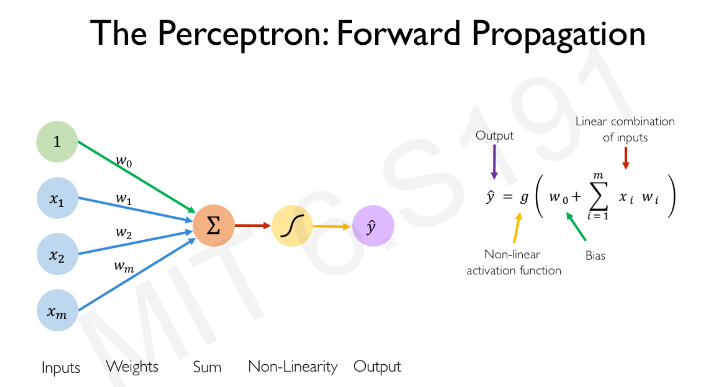.png)

## What is Bias?

The purpose of **bias** is to shift your activation function to the left or to the right. It is independent of your inputs, in other words, it will not be affected by our inputs.

## Non-Linear Activation Function

- Sigmoid Function
  - Take any real number and transform into a scalar output between 0 and 1.

## Simplified Version of The Perceptron

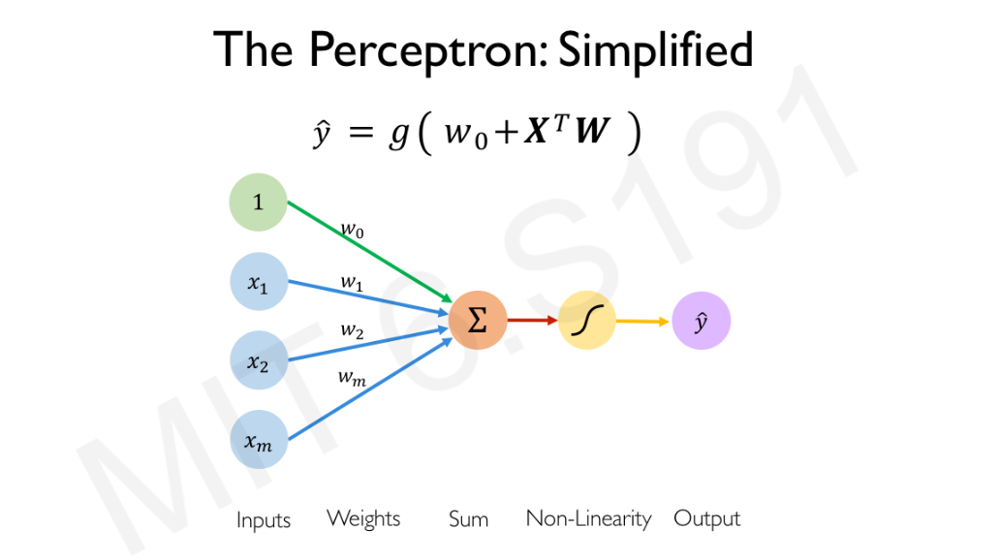

1. Take the inputs, do a dot product with the weights
2. Add the bias
3. Apply a non-linear function.

## Multi Output Perceptron
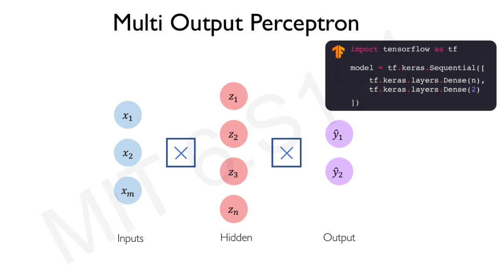

First hidden layer with `n` outputs.  
Second output layer with `2` output.  
Combine these 2 layers using sequential model.  
Sequential Models: To compose neural networks using a sequence of layers  

## Loss

1. The **loss** of our network measures the cost incurred from incorrect predictions  
2. The **empirical loss** measures the total loss over our entire dataset  
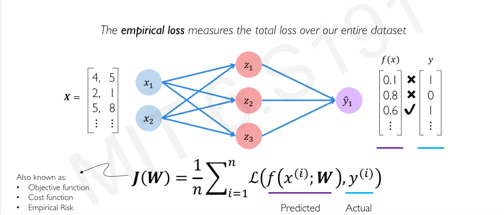
3. **Cross entropy loss** can be used with models that ouput a probability between 0 and 1. Normally used in binary problem, AKA yes or no problem.  
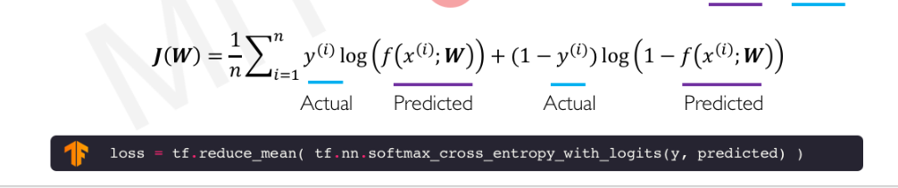
4. **Mean squared error loss** can be used with regression models that output continuous real numbers.  
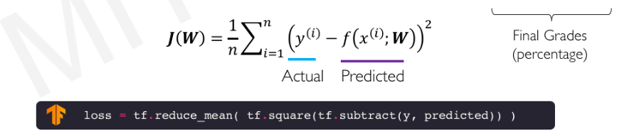

## Training Neural Network

The idea is that you want the neural network to "learn" something. But you have to let them "know" what's the meaning of each input. This is done by minimizing the **loss**. The loss is basically the difference between the actual output and the predicted output.

### Loss Optimization

We want to find the network weights that achieve the **lowest** loss

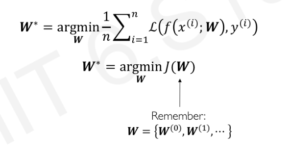

### Gradient Descent

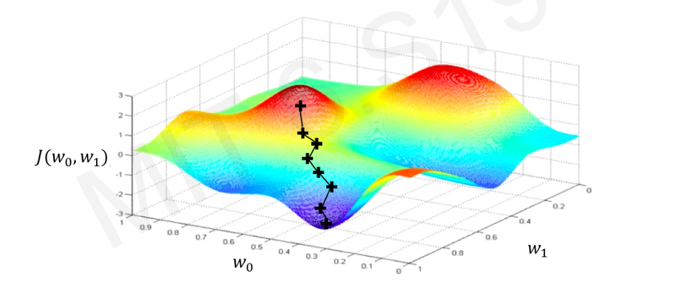

The idea is you choose a random point and start checking it's gradient. Then you take the opposite direction of the gradient that you calculated, and repeat the previous steps until you reach a convergence, meaning you either meet a local or global minima.  

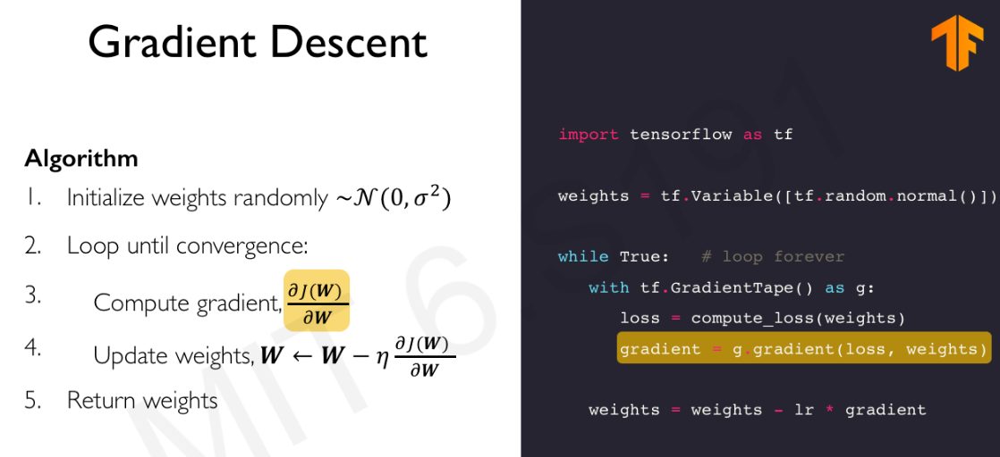

### Computing Gradient : Backpropagation

The idea is using Chain Rule!!!

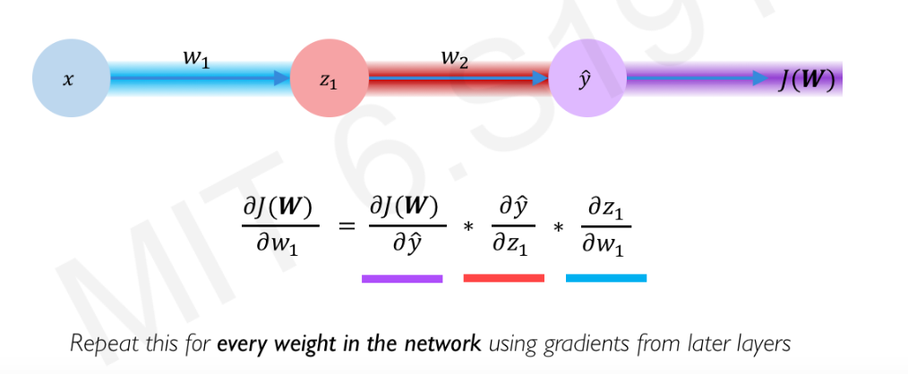

> OMG Chain Rule is here again Haunting MEEEEE

## Neural Network in Practice

### Learning Rate

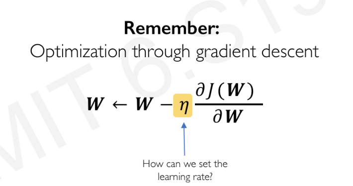

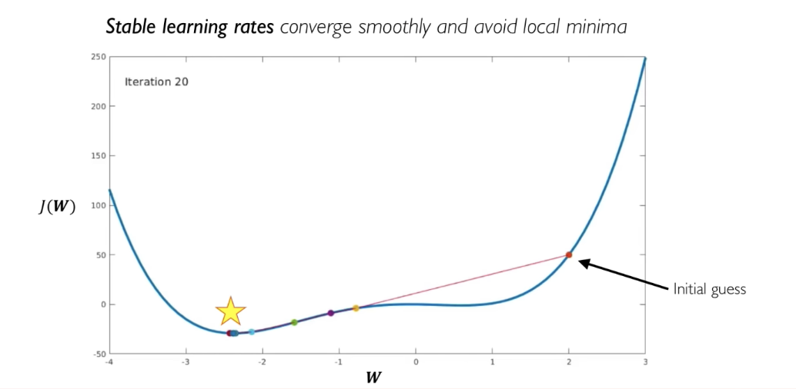

The learning rate should not be too small as it might be stucked in local minima. And it should not be too large as it might overshoot and miss your ideal result.

### Adaptive Learning Rates

- Learning rates are no longer fixed
- Can be made larger or smaller depending on:
  - how large the gradient is
  - how fast learning is happening
  - size of particular weights
  - etc...

Different Algorithm

- SGD
- Adam
- Adadelta
- Adagrad
- RMSProp

### Overfitting

Overfitting occurs when a function is too closely fit to a limited set of data points, and may therefore fail to fit additional data or predict future observations reliably.

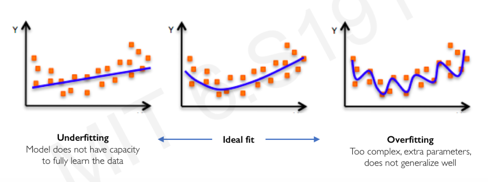

> You have gone too far!

### Regularization

Techniques that constrains our optimization problem to discourage complex models

#### Dropout

Typically 'drop' 50% of activations in layer, meaning randomly set 50% of the nodes to be 0.  
The idea is to force the network not to rely on any I node

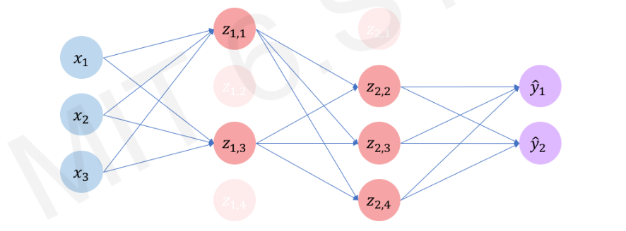

#### Early Stopping

Stop training before we have a chance to overfit.  
There will be a point where the loss during the training will be 0, meaning the training model somehow "memorize" the data points. So we can identify the point before it starts to "memorize" the "answer" and make it stop.

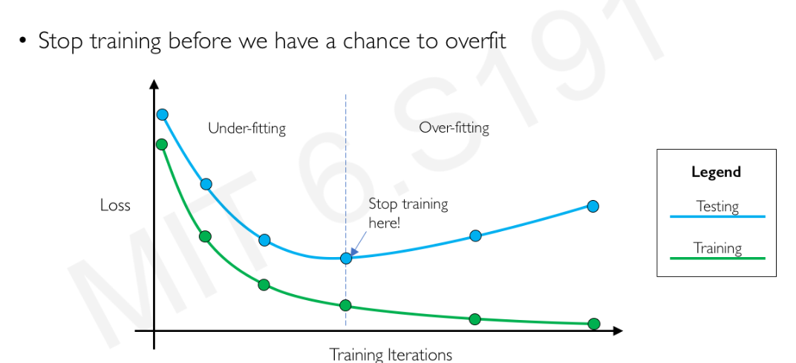

## Putting everything together

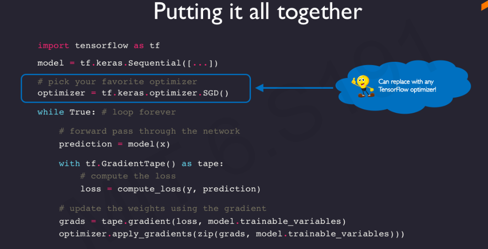

## Summary

### The perceptron (fundamental block)

- Structural building blocks
- Non-linear activation function

### Neural Networks

- Stacking perceptrons to form neural network (mimic humans' brain?)
- Optimization through backpropagation

### Training in Practice

- Adaptive Learning (Avoid missing the ideal result)
- Batching to increase the efficiency of learning and reduce resources used (GPU etc)
- Regularization to avoid overfitting