# Deep Sequence Modeling

- [Deep Sequence Modeling](#deep-sequence-modeling)
  - [Recurrent Neural Network (RNN)](#recurrent-neural-network-rnn)
    - [Update and Output](#update-and-output)
    - [Computational Graph Across Time](#computational-graph-across-time)
  - [Backpropagation through Time](#backpropagation-through-time)
    - [Standard RNN Gradient Flow](#standard-rnn-gradient-flow)
      - [Activation Functions](#activation-functions)
      - [Parameter Initialization](#parameter-initialization)
      - [Gated Cells](#gated-cells)
  - [Long Short Term Memory (LSTM) Networks](#long-short-term-memory-lstm-networks)
    - [How does it work?](#how-does-it-work)
      - [Forget](#forget)
      - [Store](#store)
      - [Update](#update)
      - [Output](#output)
    - [Summary for LSTM](#summary-for-lstm)
  - [Summary](#summary)

Sequential processing of data.  

To model sequences, we need to:

1. Handle **variable-length** sequences
2. Track **long-term** dependencies
3. Maintain information about **order**
4. **Share parameters** across the sequence

## Recurrent Neural Network (RNN)

The answer to the the mentioned problems: **Recurrent Neural Networks(RNN)**

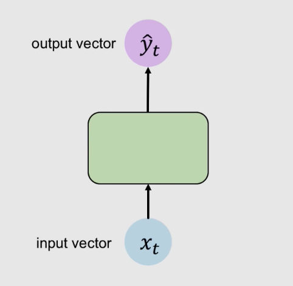

Standard neural network goes from input to output in one direction.  

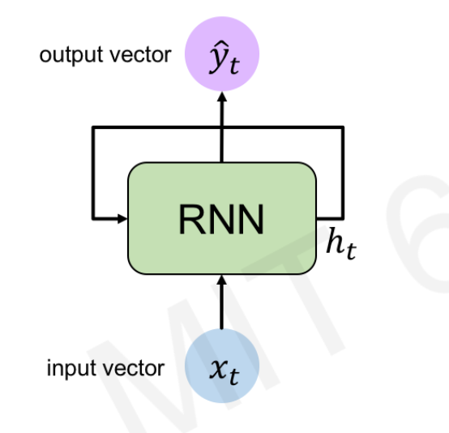

Recurrent neural network has loops in itself, to allow being processed over time internally.

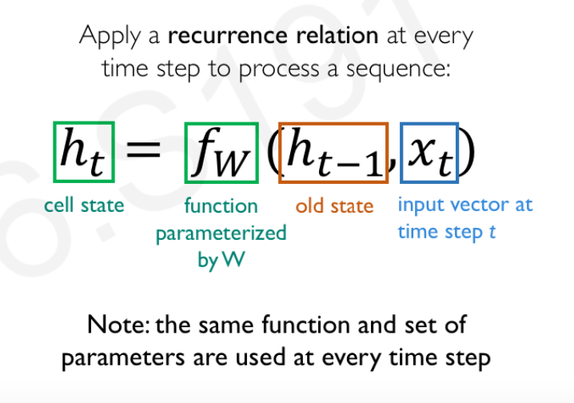

### Update and Output

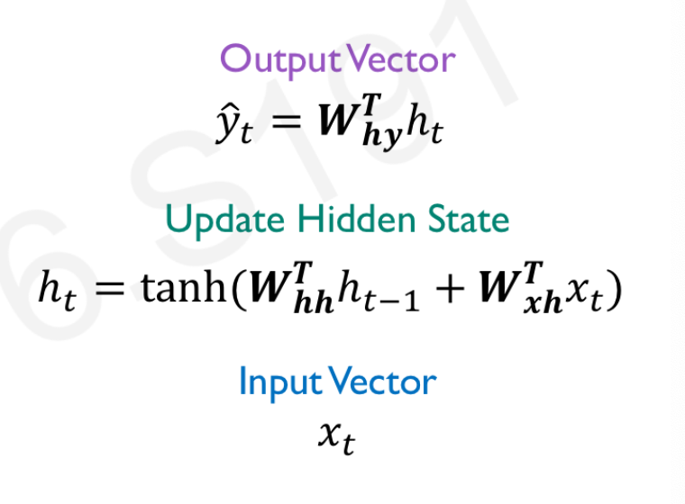

Due to 2 inputs to update hidden state, input vectors and previous state, there are 2 separate weight matrices.  

>`tanh` is one of the non-linear function

### Computational Graph Across Time

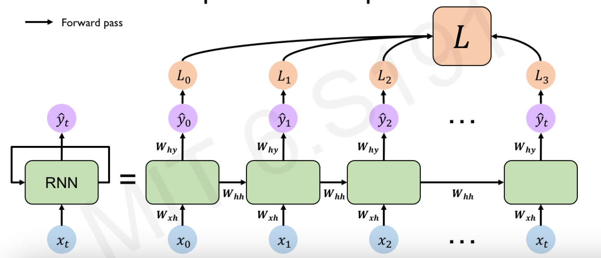

## Backpropagation through Time

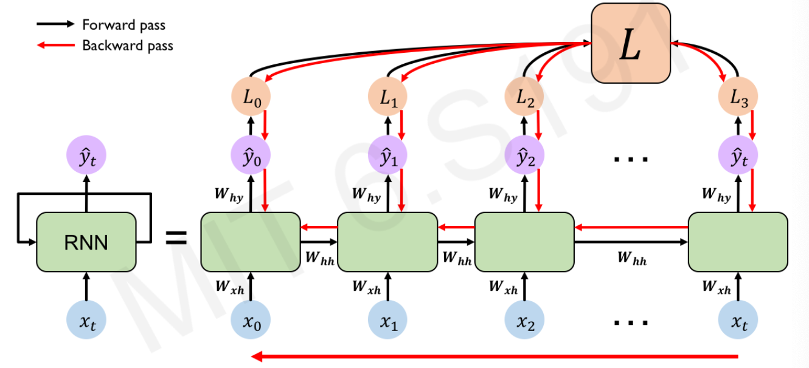

### Standard RNN Gradient Flow

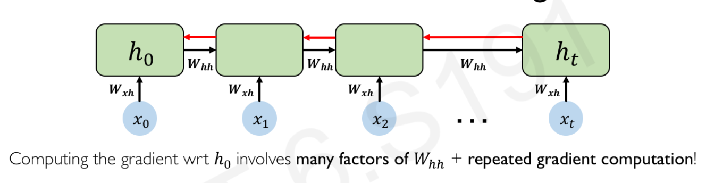

Exploding Gradient: gradient is too large such that we cannot find a minima  
Vanishing Gradient: opposite to exploding gradient, where the gradient becomes increasingly smaller when we train the model  

#### Activation Functions

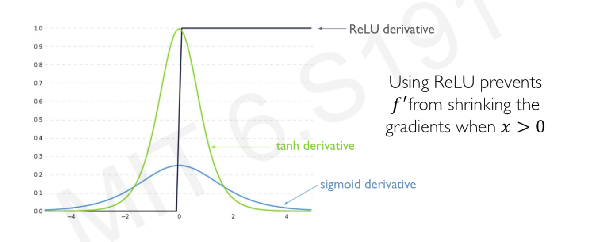

ReLU prevents **f'** from shrinking the gradients when x>0.

#### Parameter Initialization

Initialize **weights** to identity matrix  
Initializa **biases** to zero

#### Gated Cells

Use a slightly more complex recurrent unit with gates to control what information is passed through

## Long Short Term Memory (LSTM) Networks

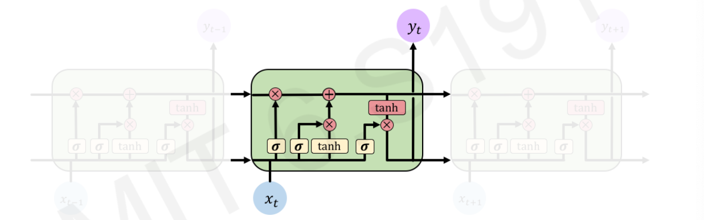

LSTM modules contain **computational blocks** that control **information flow**.  
LSTM cells are able to track information throughout many timesteps.  

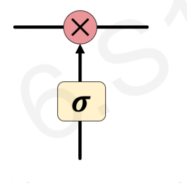

Information is added or removed through structures called **gates**.  
Gates optionally let information through, for example via a sigmoid neural net later and pointwise multiplication.  

### How does it work?

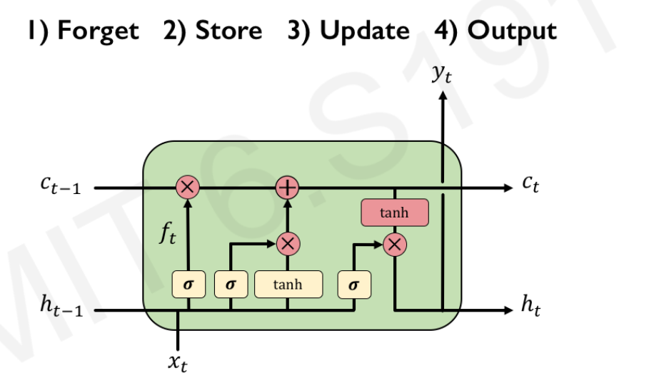

#### Forget

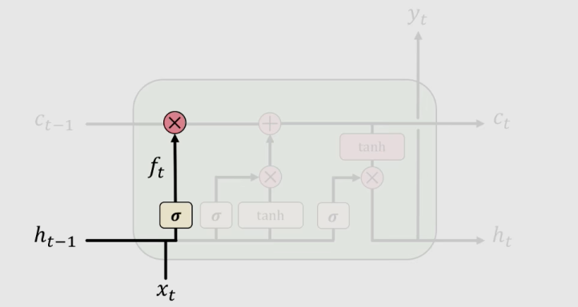

**Forget irrelavant** parts of the previous state

#### Store

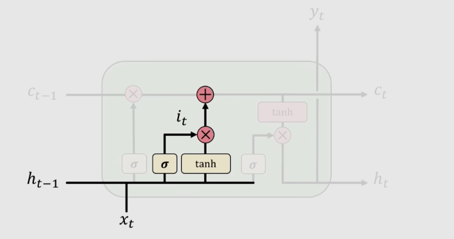

**Store relevant** new information into the next cell state

#### Update

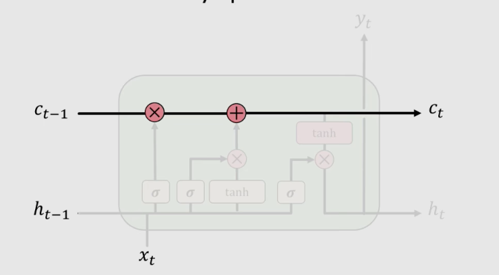

**Selectively update** cell state values

#### Output

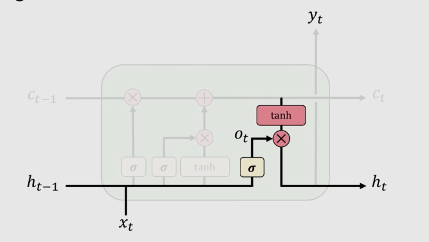

**Output gate** controls what information is sent to the next time step

### Summary for LSTM

1. Maintain a **separate cell state** from what is outputed
2. Use **gates** to control the **flow of information**
     - **Forget** gate gets rid of irrelevant information
     - **Store** relevant information from current input
     - Selectively **update** cell state
     - **Output** gate returns a filtered version of the cell state
3. Backpropagation through time with **uninterrupted gradient flow**

## Summary

1. RNNs are well suited for **sequence modeling** tasks
2. Model sequences via a **recurrence relation**
3. Training RNNs with **backpropagation through time**
4. Gated cells like **LSTMs** let us model **long-term dependencies**
5. Models for music generation, classidication, machine translation, etc.
